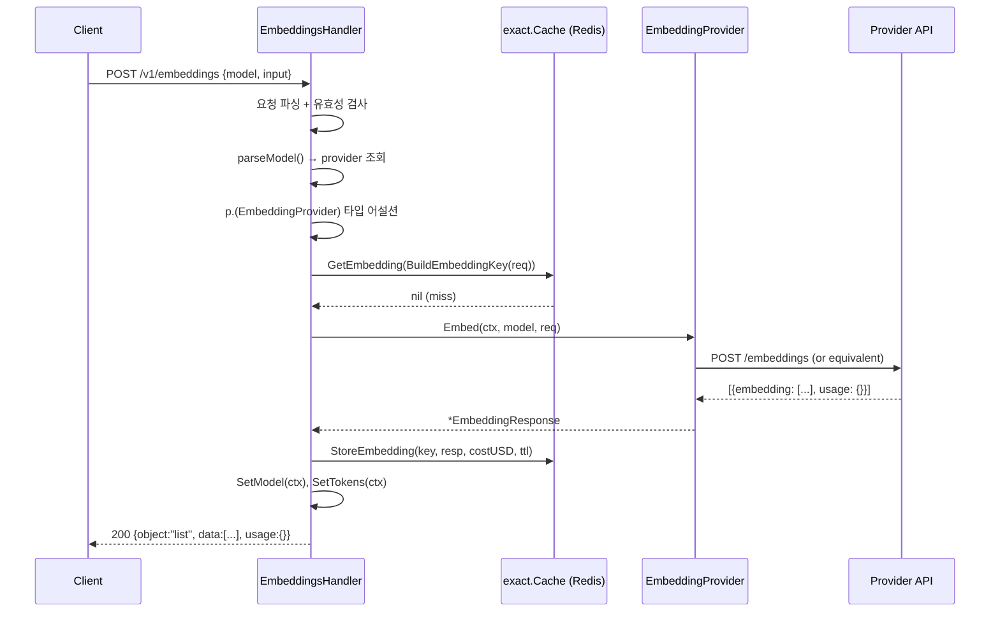
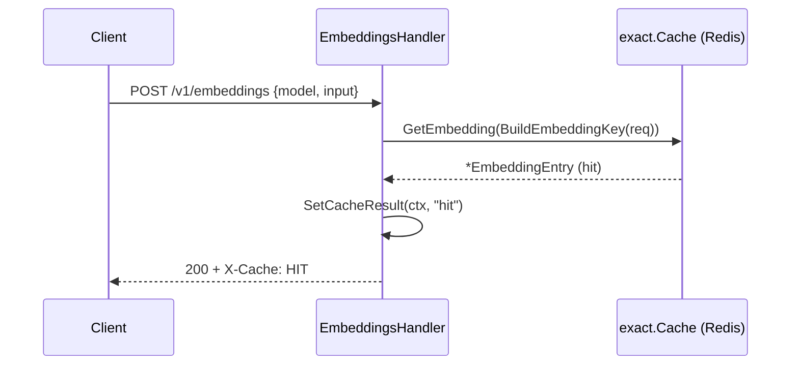
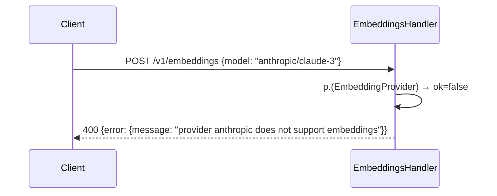

# ATL-279: Embeddings API 설계 문서

**작성일**: 2026-02-23
**기반 문서**: `docs/plan/ATL-279.plan.md`

---

## 1. Architecture Overview

### 현재 상태

```
POST /v1/embeddings
  └─ EmbeddingsHandler.Handle()
       ├─ 요청 파싱 ✅
       ├─ 유효성 검사 ✅
       ├─ Provider 조회 ✅
       └─ TODO: provider 호출 → 항상 빈 벡터 반환 ❌
```

### 목표 상태

```
POST /v1/embeddings
  └─ [Auth Middleware] → [Rate Limit] → [Budget Check]
       └─ EmbeddingsHandler.Handle()
            ├─ 요청 파싱 + 유효성 검사
            ├─ Provider 조회 + EmbeddingProvider 타입 어설션
            ├─ Cache 조회 (exact.Cache, key prefix: cache:emb:)
            │    ├─ HIT  → X-Cache: HIT 헤더 + 캐시 응답 반환
            │    └─ MISS → Provider.Embed() 호출
            │                ├─ OpenAI: POST /v1/embeddings (네이티브)
            │                ├─ Gemini: POST /v1beta/models/{model}:embedContent
            │                └─ Cohere: POST /v2/embed
            ├─ Cache 저장 (TTL: cfg.Cache.ExactMatch.DefaultTTL)
            ├─ 비용 계산 (cost.Calculator, output_tokens=0)
            └─ Telemetry (SetModel, SetTokens) → 응답 반환
```

### 관련 컴포넌트 맵

```
cmd/gateway/main.go
  └─ router.Setup(registry, fr, ..., ec, costCalc, ...) ← ec 추가 전달
       └─ handler.NewEmbeddingsHandler(registry, ec, costCalc, logger)

internal/
  provider/
    interface.go          ← EmbeddingProvider 인터페이스 추가
    openai/adapter.go     ← Embed() 구현 추가
    gemini/adapter.go     ← Embed() 구현 추가
    cohere/adapter.go     ← Embed() 구현 추가
  cache/exact/
    cache.go              ← EmbeddingEntry, GetEmbedding, StoreEmbedding 추가
    key.go                ← BuildEmbeddingKey 추가
  gateway/
    handler/embeddings.go ← 핵심 구현 (cache + provider + cost + telemetry)
    router/router.go      ← Setup() 시그니처에 ec 추가
config/models.yaml        ← Gemini/Cohere 임베딩 단가 추가
```

---

## 2. Sequence Diagrams

### 2a. 정상 요청 흐름 (캐시 미스)



### 2b. 캐시 히트 흐름



### 2c. 임베딩 미지원 Provider



---

## 3. Implementation Plan

### 파일별 변경 사항

#### 3-1. `internal/provider/interface.go`

**변경**: `EmbeddingProvider` 선택적 인터페이스 추가
**내용**: `Embed(ctx, model, req) (*EmbeddingResponse, error)` 시그니처
**주의**: 기존 `Provider` 인터페이스는 변경 없음

---

#### 3-2. `internal/provider/openai/adapter.go` + 새 파일 `embed.go`

**변경**: `Adapter`에 `Embed()` 메서드 추가 (새 파일 권장)
**내용**:
- 요청 형식: OpenAI 네이티브 (`/v1/embeddings`) — 모델명에서 `openai/` prefix 제거
- 응답: OpenAI 네이티브 형식을 `types.EmbeddingResponse`로 파싱
- API 키 해결: 기존 `a.keyFunc(ctx)` 패턴 그대로 사용
- HTTP 에러: 기존 `ParseError()` 재사용

---

#### 3-3. `internal/provider/gemini/adapter.go` + 새 파일 `embed.go`

**변경**: `Adapter`에 `Embed()` 메서드 추가 (새 파일 권장)
**내용**:
- `req.Input`을 `json.Unmarshal`로 파싱: string → 단일 API, `[]string` → 배치 API
  - 단일: `POST /v1beta/models/{model}:embedContent?key={apiKey}`
  - 배치: `POST /v1beta/models/{model}:batchEmbedContents?key={apiKey}`
- Gemini 요청 구조: `{"content": {"parts": [{"text": "..."}]}}`
- Gemini 응답 구조: `{"embedding": {"values": [...]}}`
- 응답을 `types.EmbeddingResponse`로 변환 (Usage는 `nil` — Gemini 임베딩은 토큰 수 미반환)
- API 키: query param `?key={apiKey}` 방식 (기존 ChatCompletion과 동일)

---

#### 3-4. `internal/provider/cohere/adapter.go` + 새 파일 `embed.go`

**변경**: `Adapter`에 `Embed()` 메서드 추가 (새 파일 권장)
**내용**:
- `req.Input` 파싱 후 `[]string`으로 정규화 (string → 단일 원소 배열)
- Cohere 요청 구조:
  ```
  model, texts, input_type="search_document", embedding_types=["float"]
  ```
- Cohere 응답 파싱: `embeddings.float[][]` → `[]types.Embedding`
- 토큰 수: `meta.billed_units.input_tokens` → `Usage.TotalTokens`
- Authorization 헤더: 기존 `"Bearer " + apiKey` 패턴 그대로 사용

---

#### 3-5. `internal/cache/exact/cache.go`

**변경**: 임베딩 캐시 엔트리 타입 + 메서드 추가
**내용**:
- `EmbeddingEntry` 구조체: `Response`, `CreatedAt`, `Model`, `InputTokens`, `CostUSD`
- `GetEmbedding(ctx, key) (*EmbeddingEntry, error)` — key prefix `cache:emb:`
- `StoreEmbedding(ctx, key, resp, costUSD, ttl) error` — gzip 압축 + maxSize 체크 동일하게 적용
- 기존 `Entry`, `Get`, `Store` 등은 변경 없음

---

#### 3-6. `internal/cache/exact/key.go`

**변경**: 임베딩 캐시 키 생성 함수 추가
**내용**:
- `BuildEmbeddingKey(req *types.EmbeddingRequest) string`
- 키 구성: `{model, encoding_format, normalized_input}` SHA-256
- `req.Input`(`json.RawMessage`) 정규화: `json.Unmarshal` → 재직렬화 (whitespace 차이 제거)
- `IsEmbeddingCacheable(headers map[string]string) bool` — `Cache-Control: no-cache` / `X-Gateway-No-Cache: true` 체크

---

#### 3-7. `internal/gateway/handler/embeddings.go`

**변경**: 핸들러 완성 (핵심 변경)
**내용**:
- `EmbeddingsHandler` 구조체에 `cache *exact.Cache`, `costCalc *cost.Calculator` 필드 추가
- `NewEmbeddingsHandler(registry, cache, costCalc, logger)` 시그니처 변경
- `Handle()` 메서드 내 TODO 제거 후 구현:
  1. 기존 파싱/유효성 검사 유지
  2. `EmbeddingProvider` 타입 어설션 → 실패 시 `400`
  3. 캐시 조회 (cache != nil일 때만)
  4. Provider 호출
  5. 비용 계산 (costCalc != nil일 때만, output=0)
  6. 캐시 저장
  7. Telemetry 기록
  8. 응답 반환

---

#### 3-8. `internal/gateway/router/router.go`

**변경**: `Setup()` 함수 시그니처에 `ec *exactcache.Cache` 파라미터 추가
**내용**:
- `handler.NewEmbeddingsHandler(registry, ec, costCalc, logger)` 호출로 변경
- 기존 `cacheMw`는 `/chat/completions` 전용이므로 embeddings에는 직접 캐시 객체 전달

---

#### 3-9. `cmd/gateway/main.go`

**변경**: `router.Setup()` 호출 시 `ec` 전달
**내용**:
- 기존 `ec`는 `cacheMw`, `cacheHandler`에만 전달되었음
- `router.Setup()` 호출 인수에 `ec` 추가 (이미 해당 스코프에 존재)

---

#### 3-10. `config/models.yaml`

**변경**: Gemini, Cohere 임베딩 모델 단가 추가
**내용**:
```yaml
# Gemini Embeddings (무료 티어 기준)
text-embedding-004:
  provider: google
  input_per_million_tokens: 0.00
  output_per_million_tokens: 0.00

# Cohere Embeddings
embed-english-v3.0:
  provider: cohere
  input_per_million_tokens: 0.10
  output_per_million_tokens: 0.00

embed-multilingual-v3.0:
  provider: cohere
  input_per_million_tokens: 0.10
  output_per_million_tokens: 0.00

embed-english-light-v3.0:
  provider: cohere
  input_per_million_tokens: 0.10
  output_per_million_tokens: 0.00
```

---

### 구현 순서

```
T1 → T5,T6(캐시 키) → T2,T3,T4(Provider) → T6(핸들러) → T7,T8 → T9(테스트)

의존 관계:
T1(인터페이스) → T2,T3,T4 (Provider들이 인터페이스 구현)
T5,T6(캐시)   → T6(핸들러에서 캐시 사용)
T6(핸들러)    → T7(router 배선)
T7(router)    → T8(main.go 배선)
```

---

## 4. Error Handling

| 시나리오 | HTTP 상태 | 에러 타입 | 메시지 |
|---------|-----------|-----------|--------|
| 모델 미지정 | 400 | `invalid_request_error` | `"model is required"` |
| input 미지정 | 400 | `invalid_request_error` | `"input is required"` |
| 알 수 없는 Provider | 400 | `invalid_request_error` | `"Invalid model: {model}"` |
| 임베딩 미지원 Provider | 400 | `invalid_request_error` | `"provider {name} does not support embeddings"` |
| Provider API 오류 (4xx) | 4xx 통과 | `api_error` | Provider 오류 메시지 |
| Provider 네트워크 오류 | 502 | `api_error` | `"upstream network error"` |
| 캐시 조회 실패 | 무시 (pass-through) | — | 캐시 오류는 로깅만, 요청 계속 진행 |
| 캐시 저장 실패 | 무시 | — | 캐시 저장 실패는 로깅만, 응답은 정상 반환 |
| MaxResponseSize 초과 | 무시 (캐시 생략) | — | `ErrResponseTooLarge` 로그 후 계속 |

**원칙**: 캐시 관련 오류는 요청 처리를 중단시키지 않는다. Provider 오류만 HTTP 오류로 전파한다.

---

## 5. Security Checklist

- [x] **API 키 노출 방지**: `keyFunc(ctx)` 패턴 사용 — 키는 핸들러에 전달되지 않음
- [x] **입력 크기 제한**: 기존 `io.LimitReader(r.Body, 10<<20)` 유지
- [x] **캐시 키 충돌 방지**: key prefix `cache:emb:` 로 채팅 캐시(`cache:exact:`)와 분리
- [x] **캐시 데이터 격리**: 캐시에 Virtual Key ID 등 인증 정보를 저장하지 않음 (모델+입력 기반 키만 사용)
- [x] **인증 우회 불가**: `/v1/embeddings`는 기존 Auth Middleware 범위 내 (`router.go`의 `/v1` 그룹)
- [x] **JSON 주입**: `writeError`, `writeJSON` 헬퍼를 통해 직렬화 — 직접 문자열 조립 없음
- [ ] **Cohere `input_type` 파라미터**: 외부 입력이 아닌 하드코딩 기본값 사용 (`"search_document"`)

---

## 6. Test Plan

### 6-1. `internal/provider/openai/` — `embed_test.go`

| 테스트 케이스 | 입력 | 기대 결과 |
|-------------|------|---------|
| 단일 string 입력 | `{"input": "hello"}`, mock HTTP 200 응답 | `len(resp.Data) == 1`, `len(resp.Data[0].Embedding) > 0` |
| `[]string` 배열 입력 | `{"input": ["a", "b"]}`, mock HTTP 200 | `len(resp.Data) == 2` |
| API 오류 (429) | mock HTTP 429 | `provider.GatewayError` 반환 |
| 빈 임베딩 응답 | mock HTTP 200 `data: []` | `len(resp.Data) == 0`, err=nil |

### 6-2. `internal/provider/gemini/` — `embed_test.go`

| 테스트 케이스 | 입력 | 기대 결과 |
|-------------|------|---------|
| 단일 string → embedContent API | `"hello"` | 단일 embedding 반환 |
| `[]string` → batchEmbedContents API | `["a", "b", "c"]` | 3개 embedding 반환 |
| API 키 query param 포함 여부 | — | 요청 URL에 `?key=` 포함 확인 |
| 400 오류 응답 | mock HTTP 400 | error 반환 |

### 6-3. `internal/provider/cohere/` — `embed_test.go`

| 테스트 케이스 | 입력 | 기대 결과 |
|-------------|------|---------|
| string → `[]string` 정규화 | `"hello"` | `texts: ["hello"]` 형태로 전달 |
| `[]string` 입력 | `["a", "b"]` | `texts: ["a", "b"]` 형태로 전달 |
| 토큰 수 파싱 | `meta.billed_units.input_tokens: 5` | `resp.Usage.TotalTokens == 5` |
| 인증 헤더 | — | `Authorization: Bearer {key}` 포함 확인 |

### 6-4. `internal/cache/exact/` — `key_test.go` 추가, `cache_test.go` 확장

| 테스트 케이스 | 입력 | 기대 결과 |
|-------------|------|---------|
| `BuildEmbeddingKey` - string 입력 | `{model: "x", input: "hello"}` | non-empty SHA-256 hex string |
| `BuildEmbeddingKey` - 동일 내용 다른 whitespace | `{"input":"a"}` vs `{"input": "a"}` | 동일한 키 반환 |
| `BuildEmbeddingKey` - 다른 모델 | 모델만 다른 두 요청 | 다른 키 반환 |
| `IsEmbeddingCacheable` - no-cache 헤더 | `Cache-Control: no-cache` | false |
| `IsEmbeddingCacheable` - X-Gateway-No-Cache | `X-Gateway-No-Cache: true` | false |
| `IsEmbeddingCacheable` - 일반 요청 | 헤더 없음 | true |
| `GetEmbedding` / `StoreEmbedding` - 왕복 | store 후 get | 동일 데이터 반환 |
| `StoreEmbedding` - max size 초과 | 10MB 이상 응답 | `ErrResponseTooLarge` |

### 6-5. `internal/gateway/handler/embeddings_test.go` — 기존 테스트 확장

| 테스트 케이스 | 시나리오 | 기대 결과 |
|-------------|---------|---------|
| 기존 테스트 유지 | `TestEmbeddingsHandler_StatusCodes` 기존 케이스 | 변경 없음 |
| 실제 임베딩 반환 | mock `EmbeddingProvider` → `Embed()` 정상 반환 | `data[0].embedding != nil` |
| 캐시 히트 | 캐시에 응답 저장 후 동일 요청 | `X-Cache: HIT` 헤더, `Embed()` 미호출 |
| 캐시 미스 → 저장 | 캐시 비어 있는 상태 | `Embed()` 호출, 캐시에 저장됨 |
| 임베딩 미지원 Provider | mock이 `EmbeddingProvider` 미구현 | 400 반환 |
| cache nil (미설정) | `NewEmbeddingsHandler(registry, nil, nil, logger)` | 캐시 없이 정상 동작 |
| Provider 오류 | `Embed()` → error 반환 | 502 반환 |

### 6-6. E2E 테스트 (mock HTTP server 기반)

| 시나리오 | 검증 포인트 |
|---------|-----------|
| OpenAI 임베딩 요청 성공 | status 200, `data[0].embedding` 길이 > 0, `usage.total_tokens > 0` |
| 동일 요청 2회 → 캐시 히트 | 2번째 응답에 `X-Cache: HIT` |
| Gemini 단일/배치 입력 | string, `[]string` 모두 200 반환 |
| Cohere 임베딩 요청 | 정상 벡터 + 토큰 수 반환 |
| `Cache-Control: no-cache` | 캐시 히트 없음 |
| 인증 누락 | 401 반환 |

---

## 7. 변경 파일 요약

| 파일 | 변경 유형 | 핵심 내용 |
|------|---------|---------|
| `internal/provider/interface.go` | 추가 | `EmbeddingProvider` 인터페이스 |
| `internal/provider/openai/embed.go` | 신규 | `Adapter.Embed()` + OpenAI 변환 |
| `internal/provider/gemini/embed.go` | 신규 | `Adapter.Embed()` + Gemini 변환 (단일/배치) |
| `internal/provider/cohere/embed.go` | 신규 | `Adapter.Embed()` + Cohere 변환 |
| `internal/cache/exact/cache.go` | 추가 | `EmbeddingEntry`, `GetEmbedding`, `StoreEmbedding` |
| `internal/cache/exact/key.go` | 추가 | `BuildEmbeddingKey`, `IsEmbeddingCacheable` |
| `internal/gateway/handler/embeddings.go` | 수정 | 핵심 구현 완성 |
| `internal/gateway/router/router.go` | 수정 | `Setup()` 시그니처 + 핸들러 배선 |
| `cmd/gateway/main.go` | 수정 | `router.Setup()` 호출에 `ec` 추가 |
| `config/models.yaml` | 추가 | Gemini/Cohere 임베딩 단가 |
| `internal/provider/openai/embed_test.go` | 신규 | OpenAI `Embed()` 유닛 테스트 |
| `internal/provider/gemini/embed_test.go` | 신규 | Gemini `Embed()` 유닛 테스트 |
| `internal/provider/cohere/embed_test.go` | 신규 | Cohere `Embed()` 유닛 테스트 |
| `internal/cache/exact/key_test.go` | 수정 | `BuildEmbeddingKey` 테스트 |
| `internal/gateway/handler/embeddings_test.go` | 수정 | 전체 핸들러 흐름 테스트 |
