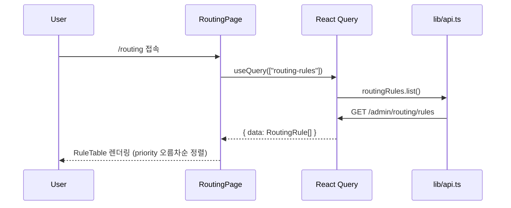
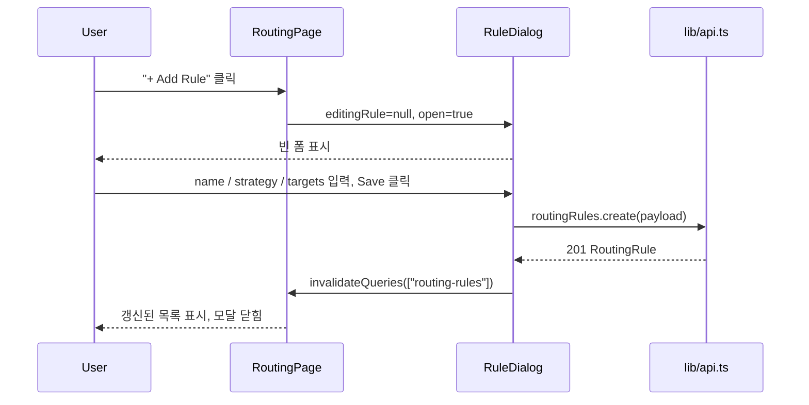
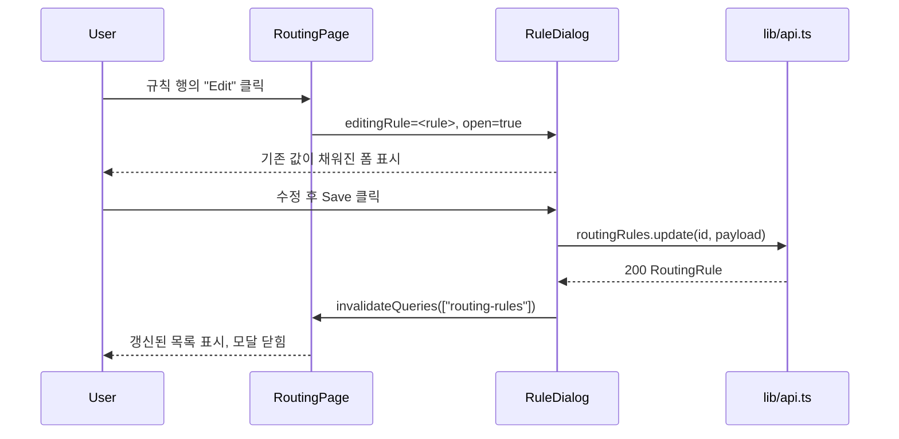
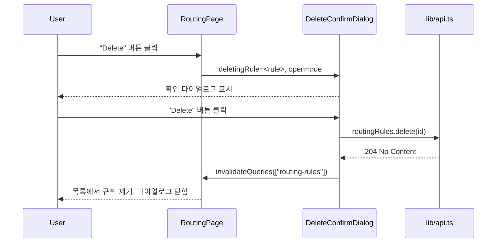
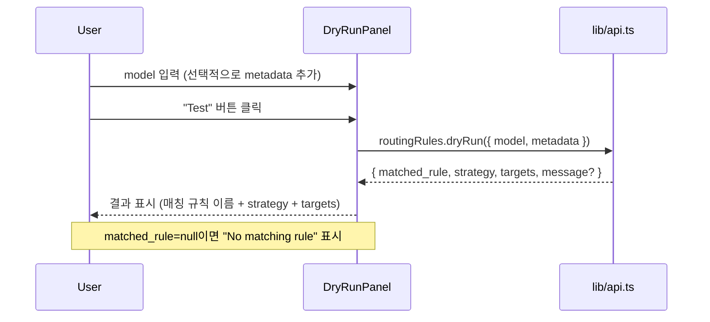
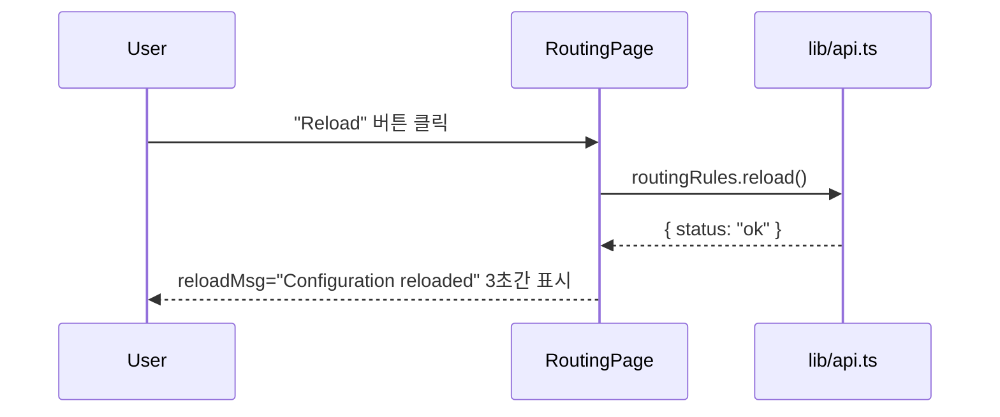

# ATL-281 Design Document
## [LLM Router] Admin UI: 라우팅 규칙 관리 페이지 (/routing)

**작성일**: 2026-02-26
**Branch**: feature/ATL-281
**기반 문서**: `docs/plan/ATL-281.plan.md`

---

## 1. Architecture

### 컴포넌트 구조

`ab-tests/page.tsx` 패턴과 동일하게 **단일 파일** (`app/(admin)/routing/page.tsx`) 내에 모든 서브 컴포넌트를 정의한다.

```
RoutingPage                           ← 메인 페이지 (상태 관리 허브)
 ├── StrategyBadge                    ← strategy 색상 배지 (표시 전용)
 ├── EnabledBadge                     ← 활성/비활성 배지 (표시 전용)
 ├── MatchSummary                     ← match 조건 요약 텍스트 (표시 전용)
 ├── RuleTable                        ← 규칙 목록 테이블
 │    └── (action buttons inlined)    ← Edit / Delete / Toggle 버튼
 ├── RuleDialog                       ← 생성/편집 모달
 │    ├── BasicFields                 ← Name, Priority, Enabled
 │    ├── AdvancedConditions          ← 접힘/펼침, match 조건 전체
 │    ├── StrategyAndTargets          ← strategy select + 동적 target 배열
 │    └── (validation inlined)        ← weight 합산 검증, UUID 형식 검증
 ├── DeleteConfirmDialog              ← 삭제 확인 다이얼로그
 └── DryRunPanel                      ← DryRun 테스트 패널 (페이지 하단 섹션)
```

### 데이터 플로우

```
lib/api.ts (routingRules, routing)
    ↓ useQuery / useMutation
RoutingPage (state 허브)
    ├── rules: RoutingRule[]          ← useQuery(["routing-rules"])
    ├── editingRule: RoutingRule | null  ← null=신규, non-null=편집
    ├── deletingRule: RoutingRule | null ← 삭제 확인 대상
    ├── reloadMsg: string | null      ← reload 결과 임시 메시지
    └── DryRunPanel 자체 state       ← dryRunModel, dryRunMetadata, dryRunResult
```

### 참조 구현 패턴

| 패턴 | 참조 파일 |
|---|---|
| useQuery / useMutation 구조 | `ab-tests/page.tsx` |
| 모달 + 폼 패턴 | `budgets/page.tsx` (BudgetModal) |
| 배지 컴포넌트 | `ab-tests/page.tsx` (StatusBadge) |
| 동적 배열 (split) | `ab-tests/page.tsx` (splits 배열) |
| 테스트 패턴 | `__tests__/ABTestsPage.test.tsx` |

---

## 2. Sequence Diagrams

### 2-1. 페이지 초기 로드



### 2-2. 규칙 생성



### 2-3. 규칙 편집



### 2-4. 규칙 삭제



### 2-5. DryRun 테스트



### 2-6. Reload



---

## 3. Implementation Plan

### 파일 변경 목록

#### 수정: `admin-ui/app/(admin)/routing/page.tsx`

전체 플레이스홀더를 실제 구현으로 교체. 순서대로 구현:

| 단계 | 구현 대상 | 설명 |
|---|---|---|
| S1 | 임포트 & 타입 정의 | `"use client"`, React/Query/api 임포트, `RuleFormState` 인터페이스 정의 |
| S2 | 표시 전용 컴포넌트 | `StrategyBadge`, `EnabledBadge`, `MatchSummary` |
| S3 | `DeleteConfirmDialog` | rule name 표시 + Delete/Cancel 버튼 |
| S4 | `DryRunPanel` | model 입력 + metadata 동적 키-값 + dryRun 결과 표시 |
| S5 | `RuleDialog` 기본 폼 | Name, Priority, Enabled, Strategy + Targets 동적 배열 |
| S6 | `RuleDialog` Advanced | match 조건 접힘/펼침 섹션 추가 |
| S7 | `RuleTable` | 규칙 목록 테이블 + Edit/Delete/Toggle 버튼 |
| S8 | `RoutingPage` (메인) | 상태 정의 + useQuery + useMutation 연결 + 전체 레이아웃 조합 |

#### 신규: `admin-ui/app/(admin)/__tests__/RoutingPage.test.tsx`

11개 테스트 케이스 구현. `ABTestsPage.test.tsx` 패턴 준수:
- `vi.mock('@/lib/api', ...)` — routingRules + routing 전체 mock
- `vi.mock('next/navigation', ...)` — usePathname → '/routing'
- `withQueryClient()` 래퍼 함수

### 주요 설계 결정

#### RuleDialog 상태 구조 (`RuleFormState`)

| 필드 | 타입 | 기본값 | 비고 |
|---|---|---|---|
| `name` | string | `""` | 필수 |
| `priority` | number | `100` | |
| `enabled` | boolean | `true` | |
| `strategy` | string | `"direct"` | select |
| `targets` | `TargetFormRow[]` | `[{provider:"",model:"",weight:0}]` | 동적 배열 |
| `matchModel` | string | `""` | Advanced |
| `matchModelPrefix` | string | `""` | Advanced |
| `matchModelRegex` | string | `""` | Advanced |
| `matchMinTokens` | string | `""` | Advanced, 빈 문자열=미설정 |
| `matchMaxTokens` | string | `""` | Advanced |
| `matchHasTools` | boolean | `false` | Advanced |
| `matchMetadata` | `{key:string;value:string}[]` | `[]` | Advanced |
| `matchKeyId` | string | `""` | Advanced |
| `matchUserId` | string | `""` | Advanced |
| `matchTeamId` | string | `""` | Advanced |
| `matchOrgId` | string | `""` | Advanced |

#### Strategy별 Targets 제어 규칙

| Strategy | 최소 타겟 | 최대 타겟 | weight 필드 |
|---|---|---|---|
| `direct` | 1 | **1** (Add 버튼 비활성) | 숨김 |
| `weighted` | 2 | 무제한 | **표시** (합산 100 검증) |
| `least_cost` | 2 | 무제한 | 숨김 |
| `failover` | 2 | 무제한 | 숨김 |
| `quality_first` | 2 | 무제한 | 숨김 |

#### Submit 가능 조건 (`canSubmit`)

1. `name.trim().length > 0`
2. `targets.length >= 1` (direct) 또는 `>= 2` (나머지)
3. 모든 target의 `provider`와 `model`이 비어있지 않음
4. `strategy === "weighted"` 이면 weight 합산 === 100
5. UUID 필드(keyId, userId, teamId, orgId)가 있으면 UUID 형식 통과
6. `mutation.isPending === false`

#### MatchSummary 표시 규칙

match 조건이 모두 비어있으면 `"Any"` 표시, 그 외에는 조건 중 첫 번째로 채워진 필드를 축약:
- `model: <value>` / `prefix: <value>` / `regex: <value>` / `context ≤ <max>k` 등
- 2개 이상 조건이 있으면 `+N more` 접미사 추가

#### Reload 피드백 방식

`useMutation.onSuccess`에서 `reloadMsg` 상태를 `"Configuration reloaded"` 로 설정하고, `setTimeout(3000)` 후 `null`로 초기화. 토스트 라이브러리 추가 없이 인라인 텍스트 메시지로 처리.

#### `routingRules.delete` 특이사항

`apiFetch`가 아닌 raw `fetch` 사용 → 401 자동 리다이렉트 없음. `DeleteConfirmDialog` 내 mutation의 `mutationFn`에서 응답 `status`를 직접 확인 후 `>= 400`이면 에러 throw.

#### rules 정렬

`useQuery` 응답 데이터를 `sort((a, b) => a.priority - b.priority)`로 클라이언트 정렬. API가 정렬을 보장하지 않는 경우에도 일관된 표시 보장.

#### DryRun matched_rule 필드 처리

`matched_rule`은 규칙 **이름**(`string`)이다 (plan 문서 기준). 이름이 그대로 표시되므로 별도 lookup 불필요. 런타임에서 UUID 형태로 온다면 `rules` 목록에서 id로 조회하여 이름을 표시하는 fallback 처리.

---

## 4. Error Handling

| 시나리오 | 처리 방법 |
|---|---|
| `routingRules.list()` 실패 | `listError` → 페이지 상단 빨간 배너 표시 |
| `create` / `update` 실패 | `RuleDialog` 내 `error` 상태 → 모달 내부 에러 텍스트 |
| `delete` 실패 | `DeleteConfirmDialog` 내 `error` 상태 → 다이얼로그 내부 에러 텍스트 |
| `reload` 실패 | `reloadError` → 페이지 상단 배너 (3초) |
| `dryRun` 실패 | `DryRunPanel` 내 `error` 상태 → 패널 내부 에러 텍스트 |
| `delete` 404 (이미 삭제됨) | 에러 무시하고 목록 refetch (낙관적 처리) |
| UUID 형식 오류 | Submit 전 클라이언트 검증 → 버튼 비활성 + 인라인 경고 |
| weight 합산 != 100 | Submit 전 클라이언트 검증 → 버튼 비활성 + 인라인 경고 |

---

## 5. Security Checklist

- [ ] XSS 방지: React JSX 렌더링 사용, `dangerouslySetInnerHTML` 미사용
- [ ] 사용자 입력(name, model regex 등)은 서버로 그대로 전송 — 서버 측 검증 위임
- [ ] UUID 형식 클라이언트 검증은 UX용 — 서버 측 최종 검증이 실제 방어선
- [ ] `routingRules.delete` raw fetch: 응답 status 코드 수동 확인 필요 (API client 미통과)
- [ ] 인증 토큰은 `apiFetch` 내 `credentials: "include"` 또는 헤더로 처리 — 별도 추가 불필요

---

## 6. Test Plan

테스트 파일: `admin-ui/app/(admin)/__tests__/RoutingPage.test.tsx`

### Mock 설정

- `vi.mock('@/lib/api')` — `routingRules` 전체 메서드 mock (`list`, `create`, `update`, `delete`, `reload`, `dryRun`)
- `vi.mock('next/navigation')` — `usePathname` → `'/routing'`
- `withQueryClient(ui)` — `QueryClient({ defaultOptions: { queries: { retry: false } } })`로 래핑
- `beforeEach`: 모든 mock 초기화, `routingRules.list.mockResolvedValue([])` 기본값 설정

### 샘플 테스트 데이터

```
sampleRule: RoutingRule = {
  id: "rule-1",
  name: "GPT-4 Direct",
  priority: 10,
  enabled: true,
  strategy: "direct",
  match: { model: "gpt-4o" },
  targets: [{ provider: "openai", model: "gpt-4o" }],
  created_at: "2026-01-01T00:00:00Z",
  updated_at: "2026-01-01T00:00:00Z",
}

weightedRule: RoutingRule = {
  id: "rule-2",
  name: "Weighted LB",
  priority: 50,
  enabled: false,
  strategy: "weighted",
  match: {},
  targets: [
    { provider: "openai", model: "gpt-4o", weight: 60 },
    { provider: "anthropic", model: "claude-3-5-sonnet", weight: 40 },
  ],
  ...
}
```

### 테스트 케이스 명세

| TC | 설명 | 입력/조건 | 기대 결과 |
|---|---|---|---|
| TC-1 | 규칙 목록 렌더링 | `routingRules.list` → `[sampleRule]` | "GPT-4 Direct", "10" (priority), "direct" badge 표시 |
| TC-2 | 빈 목록 empty state | `routingRules.list` → `[]` | "No routing rules" 텍스트 표시 |
| TC-3 | 로딩 상태 | `routingRules.list` → `new Promise(() => {})` (미해결) | "Loading" 텍스트 표시 |
| TC-4 | "+ Add Rule" → 모달 열림 | "+ Add Rule" 버튼 클릭 | `heading "Add Rule"` 존재 |
| TC-5 | Edit → 기존 값 채워진 모달 | sampleRule 로드 후 "Edit" 클릭 | `input[name=name]` value === "GPT-4 Direct" |
| TC-6 | Delete → 확인 다이얼로그 → 삭제 호출 | "Delete" 클릭 → 다이얼로그 "Delete" 확인 | `routingRules.delete` called with `"rule-1"` |
| TC-7 | Delete 취소 | "Delete" 클릭 → 다이얼로그 "Cancel" | `routingRules.delete` not called, 다이얼로그 닫힘 |
| TC-8 | RuleDialog 저장 (생성) | Add Rule → name 입력 + target 입력 → Save | `routingRules.create` called, 모달 닫힘 |
| TC-9 | weighted strategy → weight 입력란 표시 | RuleDialog 열기 → strategy "weighted" 선택 | `input[placeholder*="weight"]` 또는 weight 레이블 표시 |
| TC-10 | weight 합산 != 100 → Submit 비활성 | weighted, weight 60+60 입력 | Save 버튼 disabled, "must sum to 100" 경고 |
| TC-11 | DryRun 성공 — 매칭 결과 표시 | `dryRun` → `{ matched_rule: "GPT-4 Direct", strategy: "direct", targets: [...] }` | "GPT-4 Direct", "direct" 텍스트 표시 |
| TC-12 | DryRun 미매칭 — "No matching rule" 표시 | `dryRun` → `{ matched_rule: null, ... }` | "No" + "matching" 또는 "No matching rule" 텍스트 |
| TC-13 | Reload 버튼 → reload 호출 | "Reload" 버튼 클릭 | `routingRules.reload` called |
| TC-14 | direct strategy → Add Target 버튼 비활성 | RuleDialog에서 strategy "direct" (기본값) | "Add Target" 버튼 disabled |

---

## 7. File Summary

| 파일 | 변경 종류 | 내용 요약 |
|---|---|---|
| `admin-ui/app/(admin)/routing/page.tsx` | 수정 (전체 교체) | 플레이스홀더 → 규칙 목록 + CRUD 모달 + DryRun 패널 |
| `admin-ui/app/(admin)/__tests__/RoutingPage.test.tsx` | 신규 생성 | 14개 테스트 케이스 (위 명세 기반) |

변경 없는 파일:
- `admin-ui/lib/api.ts` — 이미 완성
- `admin-ui/components/Sidebar.tsx` — Routing 링크 이미 추가됨
