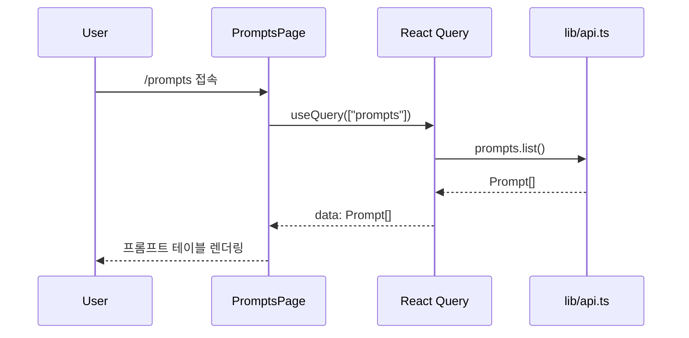
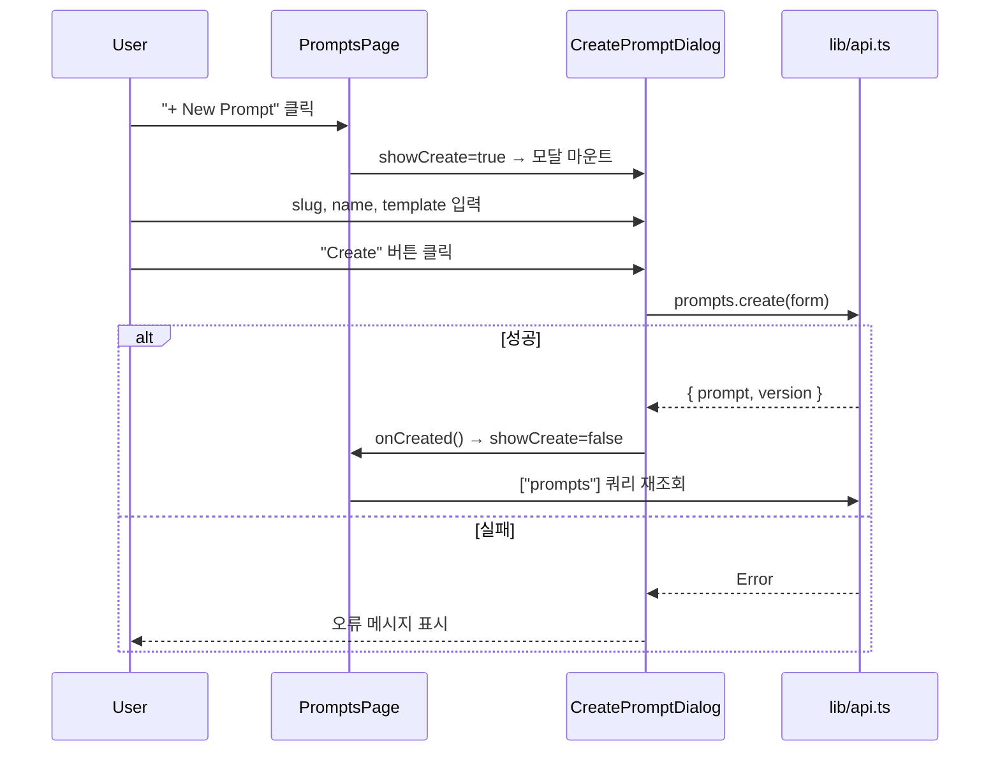
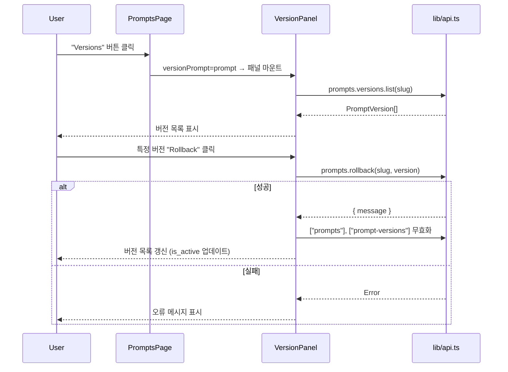
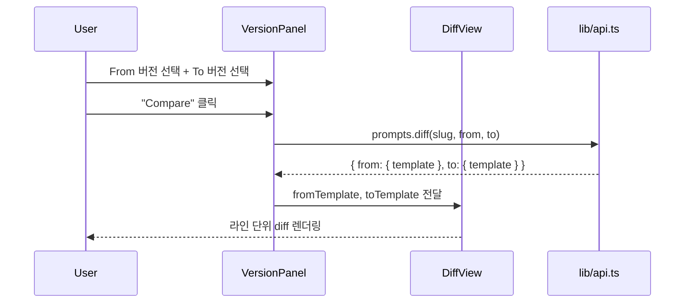

# ATL-284 Design Document
## Admin UI: 프롬프트 관리 페이지 (/prompts)

**작성일**: 2026-02-23
**기반 문서**: `docs/plan/ATL-284.plan.md`
**Branch**: feature/ATL-284

---

## 1. Architecture Overview

### 전체 구조

기존 CRUD 페이지(`keys/page.tsx`, `providers/page.tsx`)의 패턴을 그대로 따른다. 모든 컴포넌트는 `app/(admin)/prompts/page.tsx` 단일 파일에 인라인으로 구현한다.

```
admin-ui/
├── components/
│   └── Sidebar.tsx                     ← [수정] Prompts 링크 추가
└── app/(admin)/
    ├── prompts/
    │   └── page.tsx                    ← [신규] 메인 구현
    └── __tests__/
        └── PromptsPage.test.tsx        ← [신규] 컴포넌트 테스트
```

### 컴포넌트 계층

```
PromptsPage (default export)
├── CreatePromptDialog         — 프롬프트 생성 모달
│   └── VariableEditor         — 변수 하이라이팅 에디터 (textarea + overlay)
├── EditPromptDialog           — 프롬프트 편집 모달 (새 버전 생성)
│   └── VariableEditor
└── VersionPanel               — 버전 히스토리 인라인 패널
    └── DiffView               — 라인 단위 diff 시각화
```

### API 클라이언트 사용 (`lib/api.ts`)

| 동작 | API 메서드 | 반환 타입 |
|---|---|---|
| 목록 조회 | `prompts.list(teamId?)` | `Prompt[]` |
| 단건 조회 | `prompts.get(slug)` | `{ prompt, version }` |
| 프롬프트 생성 | `prompts.create(payload)` | `{ prompt, version }` |
| 새 버전 생성 (편집) | `prompts.versions.create(slug, payload)` | `PromptVersion` |
| 버전 목록 | `prompts.versions.list(slug)` | `PromptVersion[]` |
| 버전 롤백 | `prompts.rollback(slug, version)` | `{ message }` |
| Diff 조회 | `prompts.diff(slug, from, to)` | `{ from, to }` |

> **참고**: `lib/api.ts`에 `prompts.delete()`는 없다. 백엔드 `DELETE /admin/prompts/:id`는 지원되지만 클라이언트 미구현 상태. 이번 작업 범위에서 Delete 기능은 제외한다(AC에도 없음).

---

## 2. Component Design

### 2.1 VariableEditor

**역할**: `{{variable_name}}` 패턴을 시각적으로 강조하는 textarea 컴포넌트

**인터페이스**:
- Props: `value: string`, `onChange: (v: string) => void`, `placeholder?: string`, `rows?: number`

**구현 방식**:
- 스택 구조: 컨테이너(`relative`) 위에 두 레이어를 겹침
  - 하단 레이어: 배경 렌더링용 `<div>`(읽기 전용) — `{{...}}` 을 `<mark>` 태그로 변환해 하이라이팅
  - 상단 레이어: 실제 입력 `<textarea>` — `bg-transparent`, `caret-*`, `text-transparent`(또는 동일 색상) 처리
- 두 레이어는 동일한 폰트/패딩/크기/스크롤 포지션을 유지해야 동기화됨
- `onScroll` 이벤트로 div의 `scrollTop`/`scrollLeft`를 textarea와 동기화
- `{{}}` (빈 변수) 패턴도 하이라이팅하되, 유효성 경고 스타일(`bg-amber-200` vs `bg-red-200`)로 구분

**상태**:
- 내부 상태 없음 — 부모 컴포넌트의 controlled state 사용

---

### 2.2 CreatePromptDialog

**역할**: 새 프롬프트 생성 모달

**인터페이스**:
- Props: `onClose: () => void`, `onCreated: () => void`

**내부 상태**:
- `form: { slug: string, name: string, template: string, team_id?: string }` — 초기값 빈 문자열
- `error: string` — API 오류 메시지

**쿼리/뮤테이션**:
- `useMutation` → `prompts.create(form)`: 성공 시 `["prompts"]` 쿼리 무효화 + `onCreated()` 호출

**폼 필드**:
1. `slug` — 텍스트 입력 (필수, 소문자+하이픈 형식 안내)
2. `name` — 텍스트 입력 (필수)
3. `template` — `VariableEditor` (필수)
4. `team_id` — 텍스트 입력 (선택)

**레이아웃**: 기존 모달 패턴 그대로 — `fixed inset-0 bg-black/40 flex items-center justify-center z-50`

---

### 2.3 EditPromptDialog

**역할**: 프롬프트 템플릿 수정 (새 버전 생성)

**인터페이스**:
- Props: `prompt: Prompt`, `currentVersion: PromptVersion | null`, `onClose: () => void`, `onUpdated: () => void`

**내부 상태**:
- `form: { version: string, template: string }` — 초기값 현재 버전에서 로드
- `error: string`

**버전 번호 결정 로직**:
- `prompts.versions.list(prompt.slug)` 결과에서 최대 버전 번호를 찾아 자동 제안
- 버전은 사람이 읽기 좋은 문자열("1.0.1", "v2", 등 자유 입력 허용)
- 사용자가 직접 수정 가능

**쿼리/뮤테이션**:
- `useQuery(["prompt-versions", prompt.slug])` — 다이얼로그 마운트 시 버전 목록 로드 (버전 번호 제안용)
- `useMutation` → `prompts.versions.create(prompt.slug, form)`: 성공 시 `["prompts"]`, `["prompt-versions", slug]` 무효화 + `onUpdated()` 호출

**폼 필드**:
1. `version` — 텍스트 입력 (필수, 자동 제안)
2. `template` — `VariableEditor` (필수, 현재 버전 template으로 초기화)

---

### 2.4 VersionPanel

**역할**: 특정 프롬프트의 버전 히스토리 조회 + Rollback + Diff

**인터페이스**:
- Props: `prompt: Prompt`, `onClose: () => void`

**내부 상태**:
- `diffFrom: string | null` — diff 시작 버전
- `diffTo: string | null` — diff 종료 버전
- `diffData: { from: { version, template }, to: { version, template } } | null`
- `diffLoading: boolean`

**쿼리/뮤테이션**:
- `useQuery(["prompt-versions", prompt.slug])` → `prompts.versions.list(slug)` — 항상 enabled
- `useMutation` → `prompts.rollback(slug, version)`: 성공 시 `["prompts"]`, `["prompt-versions", slug]` 무효화
- Diff: `useMutation` → `prompts.diff(slug, from, to)`: 응답을 `diffData`에 저장

**레이아웃**: 오른쪽 슬라이딩 패널이 아닌, 테이블 하단에 확장되는 인라인 패널
- 배경: `bg-slate-50 border border-slate-200 rounded-lg p-4`

**버전 목록 표시**:
- 컬럼: version, is_active (badge), created_at, 액션(Rollback)
- `is_active: true`인 버전은 `✓ Active` badge 표시
- Rollback 버튼: 이미 active인 버전은 비활성화

**Diff 선택 UI**:
- "From" 드롭다운 + "To" 드롭다운 (버전 목록에서 선택)
- "Compare" 버튼 — `diffFrom !== diffTo`일 때만 활성화
- diff 결과가 있으면 `DiffView` 렌더링

---

### 2.5 DiffView

**역할**: 두 버전의 template 텍스트를 라인 단위로 시각적으로 비교

**인터페이스**:
- Props: `fromTemplate: string`, `toTemplate: string`, `fromVersion: string`, `toVersion: string`

**diff 알고리즘**:
- 두 template을 `\n`으로 분리
- 라인 단위 LCS(Longest Common Subsequence) 알고리즘으로 추가/삭제/유지 구분
- LCS 구현은 표준 DP 알고리즘 (O(m×n)), 최대 500라인 이하 상정

**시각화**:
- 삭제된 라인: `bg-red-50 text-red-700 line-through`
- 추가된 라인: `bg-green-50 text-green-700`
- 유지된 라인: `text-slate-600`
- 라인 번호 표시 (왼쪽 고정 너비 칸)

---

### 2.6 PromptsPage (메인)

**역할**: 페이지 최상위 컴포넌트

**내부 상태**:
- `showCreate: boolean` — CreatePromptDialog 표시 여부
- `editPrompt: Prompt | null` — EditPromptDialog 대상
- `versionPrompt: Prompt | null` — VersionPanel 대상

**쿼리**:
- `useQuery(["prompts"])` → `prompts.list()`: `refetchInterval: 30_000`

**레이아웃**:
- 헤더: "Prompts" 제목 + "+ New Prompt" 버튼
- 로딩 상태: 스피너 또는 스켈레톤
- 빈 상태: "No prompts yet" 텍스트 + 생성 버튼
- 테이블:
  - 컬럼: Name, Slug, Updated At, 액션(Edit, Versions)
  - 행 클릭 시 VersionPanel 토글 (또는 "Versions" 버튼)
- 인라인 VersionPanel: 선택된 prompt 아래 확장 (accordion 스타일)
- 모달: showCreate → CreatePromptDialog, editPrompt → EditPromptDialog

---

## 3. Sequence Diagrams

### 3.1 프롬프트 목록 로드



### 3.2 프롬프트 생성



### 3.3 버전 히스토리 + Rollback



### 3.4 버전 Diff



---

## 4. Implementation Plan

변경 순서와 각 파일의 변경 내용:

### Step 1: Sidebar 링크 추가

**파일**: `admin-ui/components/Sidebar.tsx`
- `nav` 배열에 `{ href: "/prompts", label: "Prompts" }` 항목 추가
- 순서: "Providers" 다음에 위치

### Step 2: 페이지 파일 생성 — 기본 구조

**파일**: `admin-ui/app/(admin)/prompts/page.tsx` (신규)
- `"use client"` 지시어 + 필요한 import 선언
- `PromptsPage` 컴포넌트: 목록 쿼리 + 테이블 렌더링 (CRUD 없이 read-only 먼저)
- 빈 상태, 로딩 상태 처리

### Step 3: VariableEditor 컴포넌트

**파일**: `admin-ui/app/(admin)/prompts/page.tsx` (Step 2에 이어서)
- `VariableEditor` 함수 컴포넌트 구현
- textarea + overlay div 스택 구조
- `{{...}}` 정규식 매칭 → `<mark>` 변환 로직
- 스크롤 동기화 (`onScroll` 핸들러)

### Step 4: CreatePromptDialog

**파일**: `admin-ui/app/(admin)/prompts/page.tsx`
- `CreatePromptDialog` 함수 컴포넌트 추가
- `useMutation` for `prompts.create()`
- `VariableEditor` 사용
- `PromptsPage`에 `showCreate` 상태 + 조건부 렌더링 추가

### Step 5: EditPromptDialog

**파일**: `admin-ui/app/(admin)/prompts/page.tsx`
- `EditPromptDialog` 함수 컴포넌트 추가
- `prompts.versions.list()` 쿼리로 버전 번호 제안
- `prompts.versions.create()` 뮤테이션
- `PromptsPage`에 `editPrompt` 상태 + "Edit" 버튼 + 조건부 렌더링 추가

### Step 6: VersionPanel + DiffView

**파일**: `admin-ui/app/(admin)/prompts/page.tsx`
- `DiffView` 함수 컴포넌트: LCS diff 알고리즘 + 라인 색상 렌더링
- `VersionPanel` 함수 컴포넌트: 버전 목록, Rollback 버튼, Diff 선택 UI + `DiffView`
- `PromptsPage`에 `versionPrompt` 상태 + "Versions" 버튼 + accordion 렌더링 추가

### Step 7: 테스트 작성

**파일**: `admin-ui/app/(admin)/__tests__/PromptsPage.test.tsx` (신규)
- 테스트 케이스 (아래 Test Plan 참조)

---

## 5. Error Handling

| 시나리오 | 처리 방식 |
|---|---|
| `prompts.list()` 실패 | 빈 목록 + 재시도 없음 (React Query 기본 retry: 1) |
| `prompts.create()` 실패 | Dialog 내 `error` 상태 → 빨간 텍스트로 표시 |
| `prompts.versions.create()` 실패 | Dialog 내 `error` 상태 → 빨간 텍스트로 표시 |
| `prompts.rollback()` 실패 | VersionPanel 내 `error` 상태 → 빨간 텍스트로 표시 |
| `prompts.diff()` 실패 | "Diff 로드 실패" 인라인 메시지 (패널 닫지 않음) |
| 버전이 1개일 때 diff 요청 | "Compare" 버튼 비활성화, 툴팁: "최소 2개 버전 필요" |
| `{{}}` 빈 변수 패턴 | 하이라이팅 유지 + `bg-red-200` 경고 색상 (저장 자체는 가능) |
| 네트워크 오류 | apiFetch에서 Error throw → 각 mutation의 onError 처리 |

---

## 6. Security Checklist

- [ ] **XSS**: VariableEditor overlay에서 `{{...}}` 패턴을 DOM에 삽입할 때 반드시 escape 처리 (`innerText` 또는 sanitize 후 innerHTML)
- [ ] **slug 입력 검증**: 프런트엔드에서 소문자+하이픈 패턴 안내 (실제 검증은 백엔드)
- [ ] **API 인증**: 모든 요청은 `apiFetch`를 통하며, Next.js 미들웨어에서 세션 쿠키 확인 — 별도 처리 불필요
- [ ] **template 크기**: 매우 긴 template 입력 시 VariableEditor 성능 저하 가능 — `max-height` + 스크롤로 UI 제한, 입력 길이 제한은 백엔드 위임
- [ ] **diff 입력 신뢰**: diff API 응답의 template은 사용자가 이전에 저장한 데이터 → 렌더링 시 텍스트로만 취급 (HTML 해석 금지)

---

## 7. Test Plan

### 7.1 Unit Tests — `__tests__/PromptsPage.test.tsx`

**Setup 공통**:
- `vi.mock("@tanstack/react-query")` + `vi.mock("@/lib/api")` 패턴
- `vi.mock("next/navigation", ...)` for usePathname/useRouter

---

#### TC-1: 프롬프트 목록 렌더링
- **입력**: `prompts.list()` → `[{ id: "1", slug: "welcome", name: "Welcome", ... }]`
- **기대**: `screen.getByText("Welcome")` 존재
- **경계**: 빈 배열 → `screen.getByText(/No prompts/i)` 존재

#### TC-2: 로딩 상태
- **입력**: `useQuery` 반환 `isLoading: true`
- **기대**: 스피너/로딩 요소 존재 또는 테이블 미렌더링

#### TC-3: CreatePromptDialog 열기/닫기
- **동작**: "+ New Prompt" 버튼 클릭
- **기대**: Dialog 제목 요소 출현
- **동작**: "Cancel" 버튼 클릭
- **기대**: Dialog 사라짐

#### TC-4: 프롬프트 생성 성공
- **입력**: Dialog에 slug="test", name="Test", template="Hello" 입력 후 "Create" 클릭
- `prompts.create` mock → resolve
- **기대**: `prompts.create` 호출됨, `queryClient.invalidateQueries(["prompts"])` 호출됨, Dialog 닫힘

#### TC-5: 프롬프트 생성 실패
- **입력**: `prompts.create` mock → reject with `new Error("slug already exists")`
- **기대**: `screen.getByText("slug already exists")` 존재, Dialog 닫히지 않음

#### TC-6: VariableEditor 하이라이팅
- **입력**: template = `"Hello {{name}}, today is {{date}}"`
- **기대**: `screen.getAllByText` 또는 DOM에 `mark` 요소 2개 존재

#### TC-7: VariableEditor 빈 변수 경고
- **입력**: template = `"Hello {{}}"`
- **기대**: 경고 스타일 클래스(`bg-red-200` 등) 적용된 요소 존재

#### TC-8: 버전 히스토리 패널 열기
- **동작**: "Versions" 버튼 클릭 (특정 prompt 행)
- `prompts.versions.list` mock → `[{ version: "1.0.0", is_active: true, ... }]`
- **기대**: `screen.getByText("1.0.0")`, `screen.getByText(/Active/i)` 존재

#### TC-9: 버전 패널 닫기
- **동작**: 패널 열린 상태에서 다시 "Versions" 클릭 또는 "Close" 클릭
- **기대**: 버전 목록 사라짐

#### TC-10: Rollback 버튼 — 활성 버전 비활성화
- **입력**: `is_active: true`인 버전의 Rollback 버튼
- **기대**: 버튼이 disabled 상태

#### TC-11: Rollback 실행
- **동작**: `is_active: false`인 버전 "Rollback" 클릭
- `prompts.rollback` mock → resolve `{ message: "ok" }`
- **기대**: `prompts.rollback(slug, version)` 호출됨, 쿼리 무효화됨

#### TC-12: Diff — Compare 버튼 비활성 (버전 미선택)
- **입력**: From/To 드롭다운 미선택 (또는 동일 버전 선택)
- **기대**: "Compare" 버튼 disabled

#### TC-13: Diff 렌더링
- **동작**: From="v1", To="v2" 선택 후 "Compare" 클릭
- `prompts.diff` mock → `{ from: { template: "line1\nline2" }, to: { template: "line1\nline3" } }`
- **기대**: `screen.getByText("line1")` (unchanged), `screen.getByText("line2")` (removed 스타일), `screen.getByText("line3")` (added 스타일)

#### TC-14: Sidebar에 Prompts 링크 존재
- `Sidebar` 렌더 후 `screen.getByRole("link", { name: "Prompts" })` 확인
- href="/prompts" 확인

---

### 7.2 E2E Test — 향후 Playwright 작성 시 참조

| 시나리오 | 전제 조건 | 검증 포인트 |
|---|---|---|
| 프롬프트 목록 접근 | 로그인 완료 | `/prompts`에서 목록 테이블 렌더링 |
| 프롬프트 생성 | 목록 페이지 오픈 | 새 항목이 목록에 추가됨 |
| 버전 히스토리 확인 | 버전 2개 이상 존재 | 버전 목록 + diff 표시 |
| Sidebar 네비게이션 | 임의 admin 페이지 | Prompts 링크 클릭 → /prompts 이동 |
