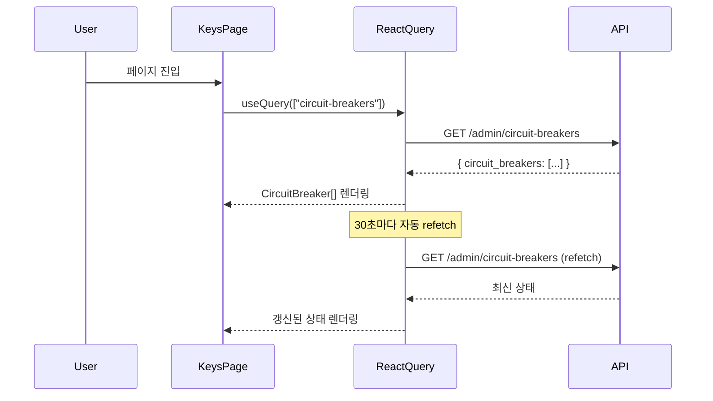
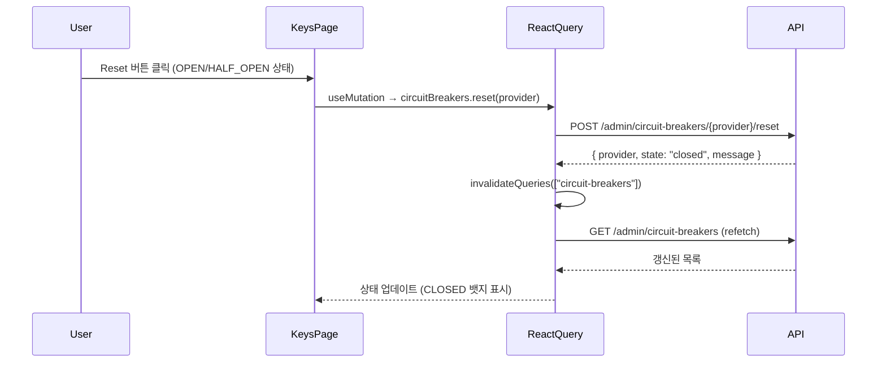

# ATL-291 설계 문서 — Admin UI: Keys 페이지 Circuit Breaker 연동

## 개요

Keys 페이지(`app/(admin)/keys/page.tsx`)에 Circuit Breaker 패널을 추가한다.
백엔드 API와 `lib/api.ts`의 `circuitBreakers` 객체는 이미 구현되어 있으며,
이 작업은 **단일 파일 UI 변경**으로 완결된다.

---

## Architecture

### 컴포넌트 구조

```
KeysPage (app/(admin)/keys/page.tsx)
├── [기존] CreateKeyDialog
├── [기존] NewKeyDisplay
├── [기존] Badge (Active/Inactive)
├── [신규] CircuitBreakerStateBadge   ← 상태별 색상 뱃지 컴포넌트
└── [신규] Circuit Breaker Section   ← useQuery + useMutation으로 조회/리셋
```

### 데이터 흐름

- **조회**: `useQuery(["circuit-breakers"], circuitBreakers.list, { refetchInterval: 30_000 })`
  - `GET /admin/circuit-breakers` → `CircuitBreaker[]`
- **리셋**: `useMutation(circuitBreakers.reset)` → 성공 시 `["circuit-breakers"]` invalidate
  - `POST /admin/circuit-breakers/{provider}/reset`

### 관련 파일 역할

| 파일 | 역할 | 변경 여부 |
|------|------|-----------|
| `admin-ui/app/(admin)/keys/page.tsx` | Keys 페이지 — Circuit Breaker 섹션 추가 | **수정** |
| `admin-ui/lib/api.ts` | `circuitBreakers.list/reset`, `CircuitBreaker` 타입 | 변경 없음 (이미 구현됨) |
| `admin-ui/app/(admin)/page.tsx` | Dashboard — 읽기 전용 CB 상태 표시 | 변경 없음 |

---

## Sequence Diagram

### 페이지 로드 및 자동 갱신



### 수동 리셋



---

## Implementation Plan

### 변경 파일: `admin-ui/app/(admin)/keys/page.tsx`

1. **import 추가**
   - `circuitBreakers`, `CircuitBreaker`를 `@/lib/api`에서 추가 import

2. **`CircuitBreakerStateBadge` 컴포넌트 추가** (파일 상단 함수 영역)
   - 상태(`closed` / `open` / `half_open`)를 받아 색상 뱃지를 반환
   - 상태 → 스타일 맵: `closed → emerald`, `open → red`, `half_open → amber`, 기본값 → `slate`
   - 표시 텍스트: `state.replace("_", " ").toUpperCase()`

3. **`KeysPage` 내 Circuit Breaker 쿼리/뮤테이션 추가**
   - `useQuery` — queryKey: `["circuit-breakers"]`, refetchInterval: 30_000
   - `useMutation` — `circuitBreakers.reset(provider)`, onSuccess: `invalidateQueries(["circuit-breakers"])`

4. **Circuit Breaker 섹션 JSX 추가** (Pagination footer 아래)
   - 섹션 헤더: "Circuit Breakers"
   - 로딩 중: "Loading…" 텍스트
   - 빈 상태: "No circuit breakers tracked" 메시지
   - 데이터 있을 때: 카드 그리드 (provider당 1개 카드)
     - Provider 이름 (capitalize)
     - `CircuitBreakerStateBadge` 로 상태 표시
     - `failure_count`, `last_failure`, `reset_time` 정보 표시
     - Reset 버튼: `state !== "closed"` 일 때만 활성화, 뮤테이션 진행 중 disabled

---

## Error Handling

| 시나리오 | 처리 전략 |
|----------|-----------|
| `circuitBreakers.list()` 실패 | `useQuery` isError 상태 → "Failed to load circuit breakers" 텍스트 표시 |
| `circuitBreakers.reset()` 실패 | `useMutation` onError → 해당 카드 내 에러 메시지 표시 (다른 버튼 영향 없음) |
| `state`가 알 수 없는 값 | `stateStyles` 맵 기본값(`slate`) 적용 |
| `reset_time` / `last_failure`가 없음 | null 체크 후 "—" 표시 |
| 여러 Provider 동시 리셋 | 각 mutation이 독립적으로 동작 (버튼별 개별 isPending 상태 관리 불필요 — 전체 뮤테이션 1개로 충분) |

---

## Security Checklist

- [x] Circuit Breaker 엔드포인트는 Admin 전용 (기존 auth 미들웨어가 `GET/POST /admin/*` 보호)
- [x] provider 값은 서버가 반환한 값을 그대로 URL에 사용 — XSS 위험 없음 (apiFetch 내부에서 URL 조합)
- [x] Reset 작업은 멱등성 보장 (이미 CLOSED인 서킷에 reset 호출해도 무해하며, UI에서 버튼 비활성화로 1차 방어)

---

## Test Plan

### Unit Tests (`keys.test.tsx` — 신규 생성 또는 기존 파일에 추가)

#### CircuitBreakerStateBadge 컴포넌트

| 테스트 케이스 | 입력 | 기대 결과 |
|--------------|------|-----------|
| CLOSED 상태 뱃지 | `state="closed"` | emerald 색상, "CLOSED" 텍스트 |
| OPEN 상태 뱃지 | `state="open"` | red 색상, "OPEN" 텍스트 |
| HALF_OPEN 상태 뱃지 | `state="half_open"` | amber 색상, "HALF OPEN" 텍스트 |
| 알 수 없는 상태 | `state="unknown"` | slate 기본 색상 적용 |

#### Circuit Breaker 섹션 렌더링

| 테스트 케이스 | 조건 | 기대 결과 |
|--------------|------|-----------|
| 로딩 상태 | `isLoading=true` | "Loading…" 텍스트 표시 |
| 빈 목록 | `circuit_breakers=[]` | "No circuit breakers tracked" 표시 |
| 데이터 있음 | CB 목록 2개 | provider 이름, 상태 뱃지, failure_count 모두 표시 |
| Reset 버튼 활성화 | `state="open"` | Reset 버튼이 enabled |
| Reset 버튼 비활성화 | `state="closed"` | Reset 버튼이 disabled |
| Reset 버튼 비활성화 | `state="half_open"` | Reset 버튼이 enabled |

#### 인터랙션

| 테스트 케이스 | 행동 | 기대 결과 |
|--------------|------|-----------|
| Reset 성공 | Reset 버튼 클릭 → API 200 | `["circuit-breakers"]` 쿼리 invalidate 호출 |
| Reset 실패 | Reset 버튼 클릭 → API 500 | 에러 메시지 렌더링 |
| 자동 갱신 설정 | useQuery 설정 확인 | `refetchInterval: 30_000` 설정됨 |

### 수동 E2E 체크리스트

- [ ] Keys 페이지 진입 시 Circuit Breaker 섹션이 Virtual Keys 테이블 아래에 표시됨
- [ ] OPEN 상태의 Provider에 Reset 버튼이 활성화되어 있음
- [ ] CLOSED 상태의 Provider에 Reset 버튼이 비활성화(회색)됨
- [ ] Reset 클릭 후 해당 Provider 상태가 CLOSED로 갱신됨
- [ ] 30초 후 자동으로 상태가 갱신됨
- [ ] Circuit Breaker가 없을 때 빈 상태 메시지가 표시됨
